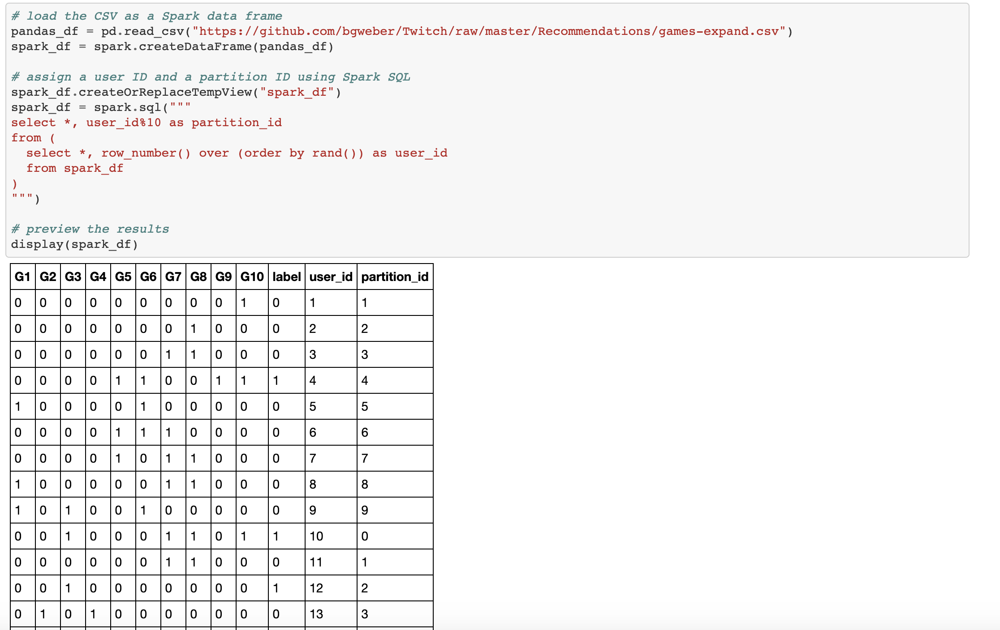

# DBSCAN-on-Spark
* Small Example demonstrating how we can use DBSCAN with a groupby in a distributed manner across multiple worker nodes, using Pandas UDF in Spark. Pandas UDF was introduced in Spark 2.3 and was a drastic step for improvement from older Spark version. They showed promising results and can solve a lot of 
problems that are not easy to solve in Native PySpark API. In this example, we look at how we can use the scikit-learn DBSCAN implementation to scale the algorithm for big data if we plan to use it with a groupBy(which is most often a valid use-case).

* Example is a trivial-one but the purpose was to demonstrate the power of Pandas UDF and how you can practically scale this to any amount of data you wish.

* Do note that each group should be able to fit in the worker memory(which probably should for most real use-cases, otherwise you can try to increase amount of RAM on your worker nodes using sparkCong while creating the instance), otherwise this won't work.

* Generally, we would need a partition ID for distributing the tasks across multiple workers, that can a Unique ID assigned to each group, or we can also generate a partition ID, as shown in the snippet below - 

